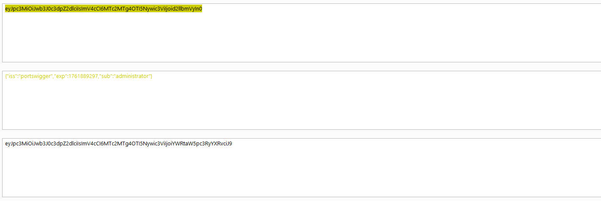
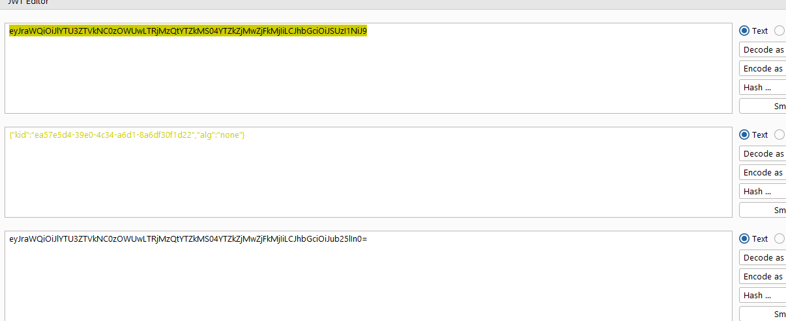
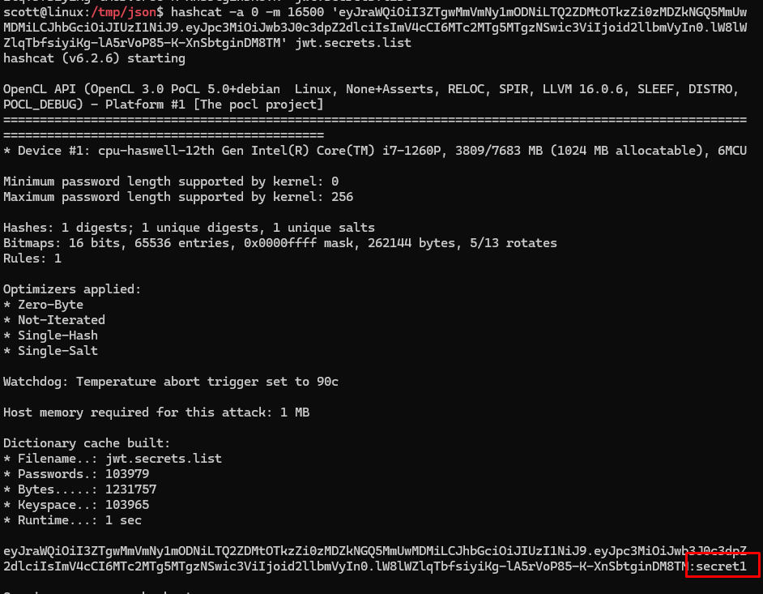
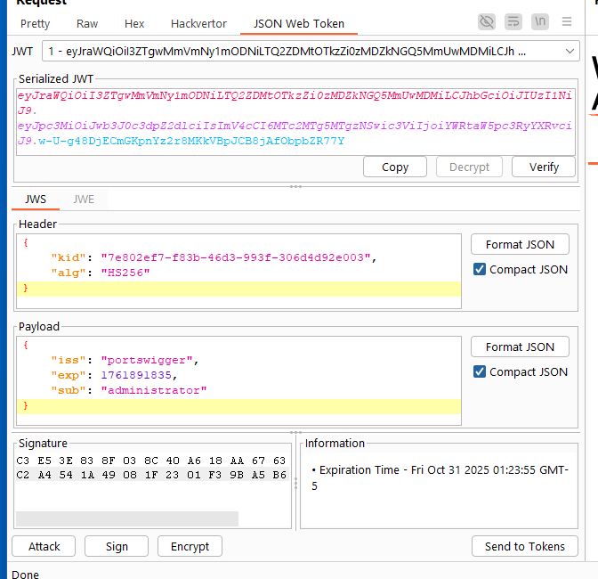
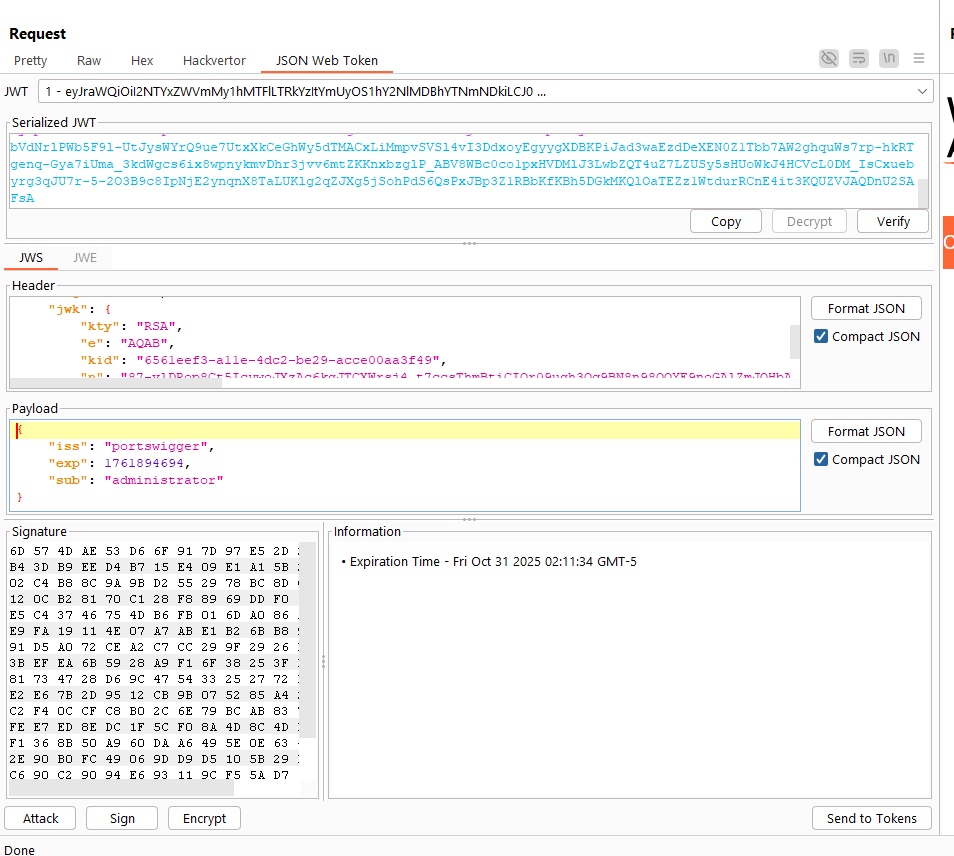
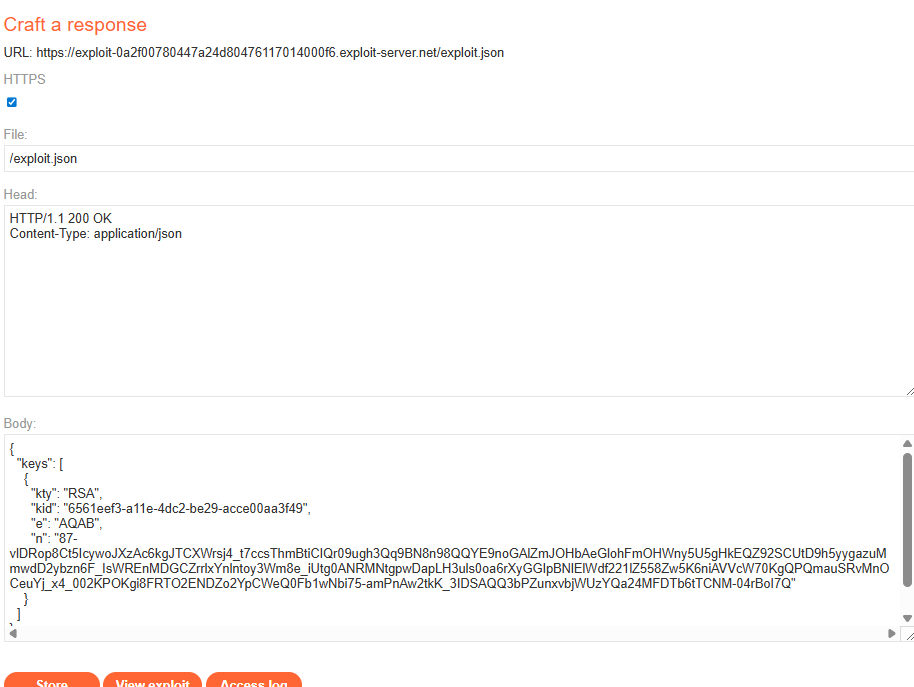
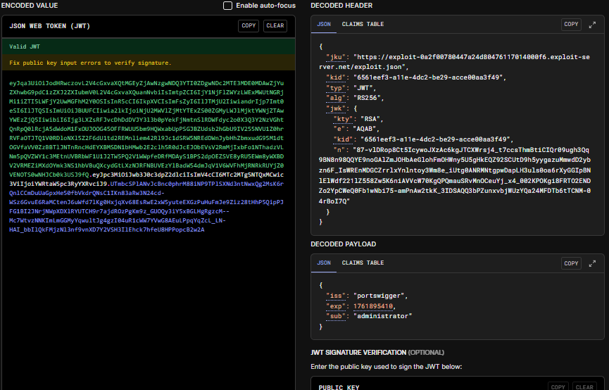
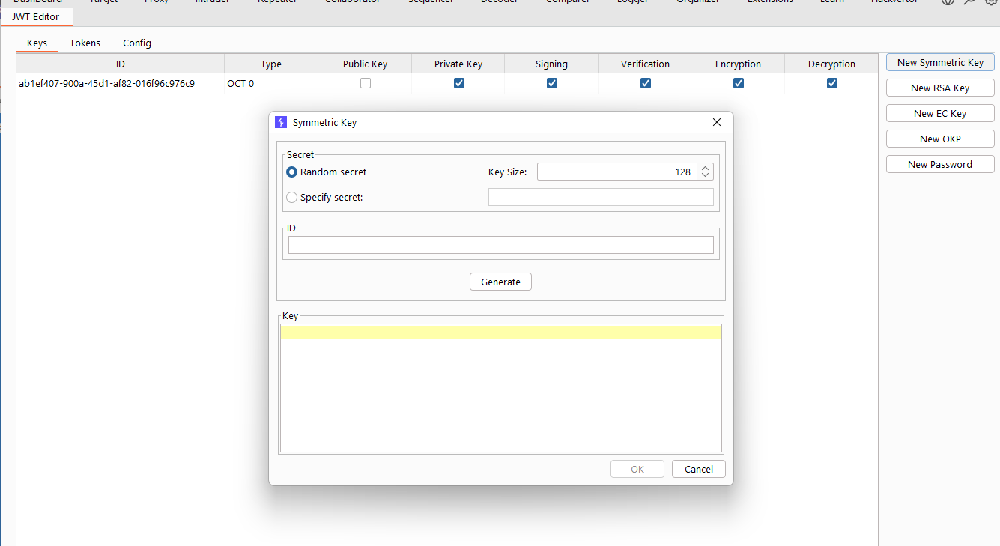
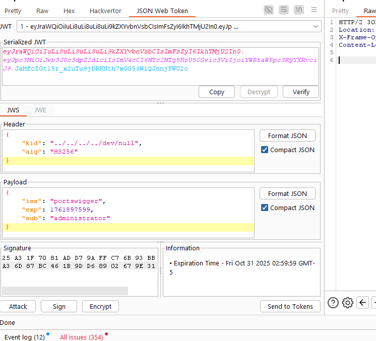

#### Lab: JWT authentication bypass via unverified signature

Modificar en el claim el username por `administrator`

![Pasted image 20251030234311.png](img/
________
####_Lab:_JWT_authentication_bypass_via_unverified_signature

Modificar_en_el_claim_el_username_por_`administrator`

#### Lab: JWT authentication bypass via flawed signature verification

Utilizar el `alg` en none

#### Lab: JWT authentication bypass via weak signing key

identificamos la secret key con fuerza bruta y lo firmamos

#### Lab: JWT authentication bypass via jwk header injection

Añadimos un jwk firmado con nuestra clave privada

#### Lab: JWT authentication bypass via jku header injection

Configuramos un servidor que almacene un JSON con valores de jwk

Modificamos el JWT y embebemos un jku y un json web key set url apuntando a nuestro servidor 

#### Lab: JWT authentication bypass via kid header path traversal

Creamos un secret key vacio. 

En el parametro del header `kid` ponermos el path traversal apuntando a /dev/null y lo firmamos con nuestro secret key vacio 

 -replace " ", "_"
    )

#### Lab: JWT authentication bypass via flawed signature verification

Utilizar el `alg` en none

#### Lab: JWT authentication bypass via weak signing key

identificamos la secret key con fuerza bruta y lo firmamos

#### Lab: JWT authentication bypass via jwk header injection

Añadimos un jwk firmado con nuestra clave privada

#### Lab: JWT authentication bypass via jku header injection

Configuramos un servidor que almacene un JSON con valores de jwk

Modificamos el JWT y embebemos un jku y un json web key set url apuntando a nuestro servidor 

#### Lab: JWT authentication bypass via kid header path traversal

Creamos un secret key vacio. 

En el parametro del header `kid` ponermos el path traversal apuntando a /dev/null y lo firmamos con nuestro secret key vacio 

