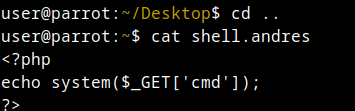
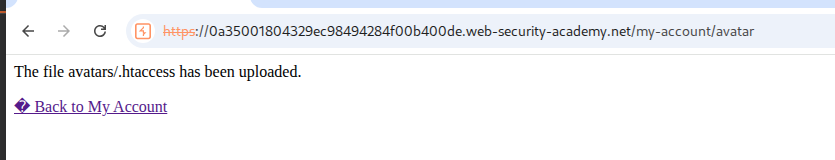
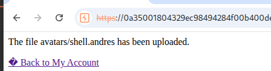
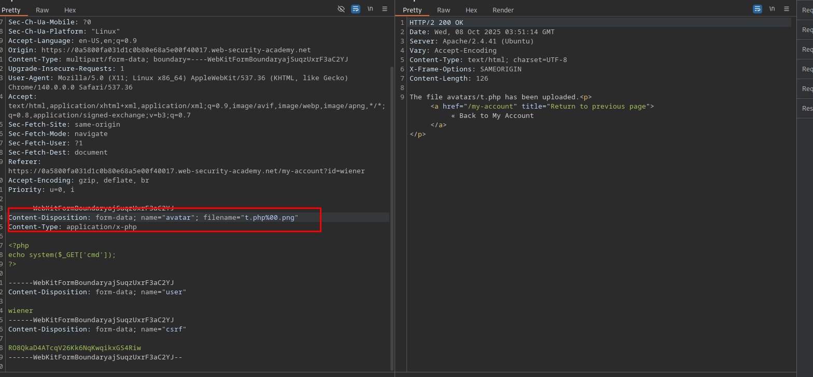
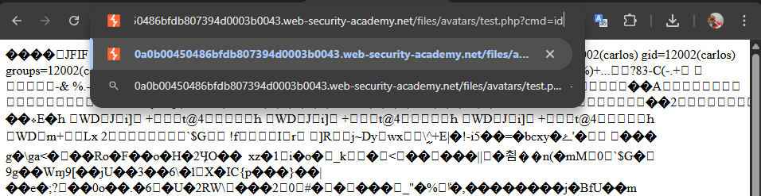

## Lab: Remote code execution via web shell upload

## Lab: Web shell upload via Content-Type restriction bypass

## Lab: Web shell upload via path traversal

## Lab: Web shell upload via extension blacklist bypass

## Lab: Web shell upload via obfuscated file extension

## Lab: Remote code execution via polyglot web shell upload

 -replace " ", "_"
    )

## Lab: Web shell upload via Content-Type restriction bypass

## Lab: Web shell upload via path traversal

## Lab: Web shell upload via extension blacklist bypass

## Lab: Web shell upload via obfuscated file extension

## Lab: Remote code execution via polyglot web shell upload

 -replace " ", "_"
    )

## Lab: Web shell upload via Content-Type restriction bypass

## Lab: Web shell upload via Content-Type restriction bypass

## Lab: Web shell upload via path traversal

## Lab: Web shell upload via extension blacklist bypass

## Lab: Web shell upload via obfuscated file extension

## Lab: Remote code execution via polyglot web shell upload

 -replace " ", "_"
    )

## Lab: Web shell upload via Content-Type restriction bypass

## Lab: Web shell upload via path traversal

## Lab: Web shell upload via extension blacklist bypass

## Lab: Web shell upload via obfuscated file extension

## Lab: Remote code execution via polyglot web shell upload

 -replace " ", "_"
    )

## Lab: Web shell upload via path traversal

## Lab: Web shell upload via Content-Type restriction bypass

## Lab: Web shell upload via path traversal

## Lab: Web shell upload via extension blacklist bypass

## Lab: Web shell upload via obfuscated file extension

## Lab: Remote code execution via polyglot web shell upload

 -replace " ", "_"
    )

## Lab: Web shell upload via extension blacklist bypass

## Lab: Web shell upload via Content-Type restriction bypass

## Lab: Web shell upload via path traversal

## Lab: Web shell upload via extension blacklist bypass

## Lab: Web shell upload via obfuscated file extension

## Lab: Remote code execution via polyglot web shell upload

 -replace " ", "_"
    )

## Lab: Web shell upload via Content-Type restriction bypass

## Lab: Web shell upload via path traversal

## Lab: Web shell upload via extension blacklist bypass

## Lab: Web shell upload via obfuscated file extension

## Lab: Remote code execution via polyglot web shell upload

 -replace " ", "_"
    )

## Lab: Web shell upload via Content-Type restriction bypass

## Lab: Web shell upload via path traversal

## Lab: Web shell upload via extension blacklist bypass

## Lab: Web shell upload via obfuscated file extension

## Lab: Remote code execution via polyglot web shell upload

 -replace " ", "_"
    )

## Lab: Web shell upload via Content-Type restriction bypass

## Lab: Web shell upload via path traversal

## Lab: Web shell upload via extension blacklist bypass

## Lab: Web shell upload via obfuscated file extension

## Lab: Remote code execution via polyglot web shell upload

 -replace " ", "_"
    )

## Lab: Web shell upload via Content-Type restriction bypass

## Lab: Web shell upload via path traversal

## Lab: Web shell upload via extension blacklist bypass

## Lab: Web shell upload via obfuscated file extension

## Lab: Remote code execution via polyglot web shell upload

 -replace " ", "_"
    )
## Lab: Web shell upload via obfuscated file extension

## Lab: Web shell upload via Content-Type restriction bypass

## Lab: Web shell upload via path traversal

## Lab: Web shell upload via extension blacklist bypass

## Lab: Web shell upload via obfuscated file extension

## Lab: Remote code execution via polyglot web shell upload

 -replace " ", "_"
    )

## Lab: Web shell upload via Content-Type restriction bypass

## Lab: Web shell upload via path traversal

## Lab: Web shell upload via extension blacklist bypass

## Lab: Web shell upload via obfuscated file extension

## Lab: Remote code execution via polyglot web shell upload

 -replace " ", "_"
    )

## Lab: Remote code execution via polyglot web shell upload

## Lab: Web shell upload via Content-Type restriction bypass

## Lab: Web shell upload via path traversal

## Lab: Web shell upload via extension blacklist bypass

## Lab: Web shell upload via obfuscated file extension

## Lab: Remote code execution via polyglot web shell upload

 -replace " ", "_"
    )

## Lab: Web shell upload via Content-Type restriction bypass

## Lab: Web shell upload via path traversal

## Lab: Web shell upload via extension blacklist bypass

## Lab: Web shell upload via obfuscated file extension

## Lab: Remote code execution via polyglot web shell upload

 -replace " ", "_"
    )

